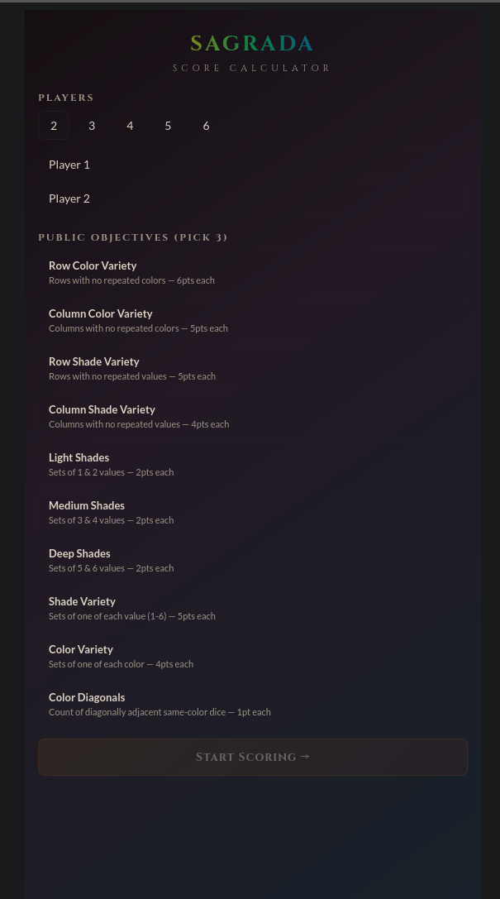
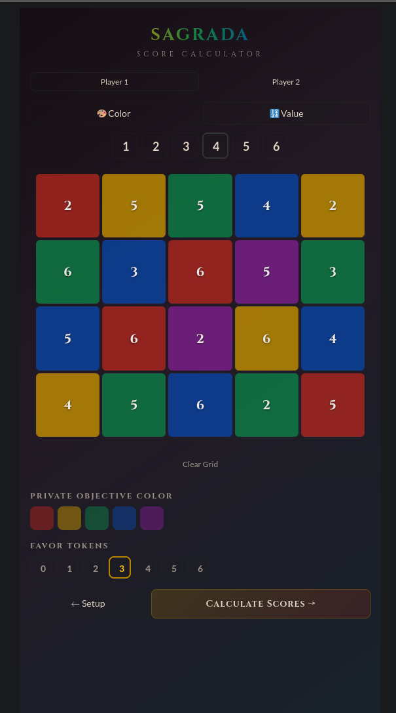
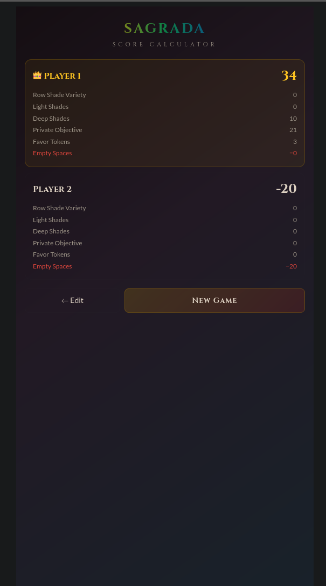

# Sagrada Score Calculator

A companion app for the board game Sagrada that handles end-game scoring.
https://sagrada-score-card.vercel.app/

## Features

- 2–6 player support (base game + expansion)
- All 10 public objective cards
- Private objective scoring by color
- Favor token tracking
- Empty space penalty
- Tap-to-fill 5×4 window grid with color and value painting modes

<p align="center">
  
  
  
</p>

## Setup

```bash
npm install
npm run dev
```

Opens at `localhost:5173`.

## Build

```bash
npm run build
```

Outputs a static site to `dist/` that can be deployed anywhere.
